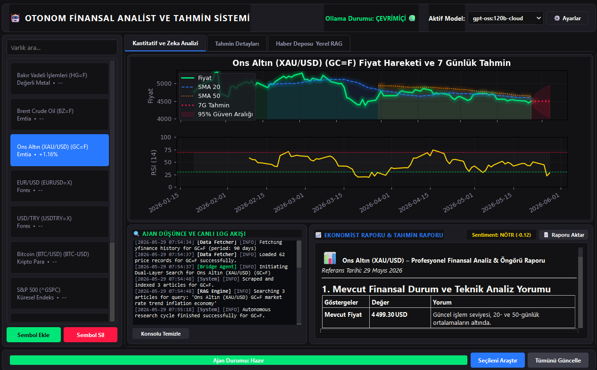

Gerekli olan Blazin Fast Scraper API'sini eklemek için: https://github.com/yugohubo/fastapi-article-scraper

Videolu Anlatım: https://drive.google.com/file/d/140wvV6IYDU6p_ioKBeVVDcdLLadYijGZ/view?usp=sharing


<p align="center">
  
  
  
  
</p>

<h1 align="center">🤖 Otonom Finansal Analist ve Tahmin Sistemi</h1>
<h3 align="center"><em>AI-Powered Autonomous Market Intelligence</em></h3>

<p align="center">
  Küresel piyasaları otonom olarak araştıran, haberleri kazıyan, teknik analiz yapan<br/>
  ve yapay zekâ destekli makroekonomist raporları üreten masaüstü finansal istihbarat platformu.
</p>

<p align="center">
  
</p>

---

## 🎯 Ne İşe Yarar?

**Otonom Finansal Analist**, yatırımcılar ve finans profesyonelleri için tasarlanmış, tamamen yerel çalışan bir **masaüstü finansal istihbarat platformudur.** Tek tuşla:

1. 🌐 İnternette en güncel ekonomik haberleri **otonom olarak araştırır**
2. 📰 Bulunan haberleri yüksek hızlı kazıyıcıyla **otomatik olarak çeker ve işler**
3. 📊 Piyasa verilerini indirip **teknik analiz ve istatistiksel tahmin** yapar
4. 🤖 Tüm verileri yapay zekâya besleyerek **uzman seviye makroekonomist raporu** üretir
5. 📡 Tüm süreci **canlı log akışı** ile anlık olarak ekranda gösterir

> **Özetle:** Bir makroekonomistin, bir veri bilimcinin ve bir haber analistinin işini tek bir butonla, saniyeler içinde, tamamen otomatik olarak yapar.

---

## 🏗️ Sistem Mimarisi

```
┌─────────────────────────────────────────────────────────────────────┐
│                    OTONOM FİNANSAL ANALİST SİSTEMİ                 │
├─────────────────────────────────────────────────────────────────────┤
│                                                                     │
│  ┌──────────────┐    ┌──────────────┐    ┌──────────────────────┐   │
│  │  🔍 KÖPRÜ    │───▶│  🚀 HIZLI   │───▶│  🧠 ANALİZ & TAHMİN │   │
│  │    AJANI     │    │   KAZIYICI   │    │      MOTORU          │   │
│  │              │    │              │    │                      │   │
│  │ DuckDuckGo   │    │ 3 Katmanlı   │    │ Teknik Göstergeler   │   │
│  │ Akıllı Arama │    │ Scraping     │    │ ARIMA Forecasting    │   │
│  │ Spam Filtre  │    │ Anti-Bot     │    │ RAG Vektör Arama     │   │
│  │ Domain Boost │    │ Fallback     │    │ LLM Ekonomist Rapor  │   │
│  └──────────────┘    └──────────────┘    └──────────────────────┘   │
│         │                    │                       │              │
│         ▼                    ▼                       ▼              │
│  ┌─────────────────────────────────────────────────────────────┐    │
│  │                  💾 YEREL VERİTABANI KATMANI                │    │
│  │     SQLite (WAL Mode) + TF-IDF Vektör Deposu (RAG)         │    │
│  └─────────────────────────────────────────────────────────────┘    │
│                              │                                      │
│                              ▼                                      │
│  ┌─────────────────────────────────────────────────────────────┐    │
│  │              🖥️ NATIVE MASAÜSTÜ ARAYÜZÜ (PyQt6)            │    │
│  │  Cyberpunk Tema │ Canlı Grafikler │ Log Konsolu │ Raporlar  │    │
│  └─────────────────────────────────────────────────────────────┘    │
│                                                                     │
└─────────────────────────────────────────────────────────────────────┘
```

---

## ✨ Temel Özellikler

### 📊 Kantitatif Teknik Analiz Motoru
| Gösterge | Açıklama |
|----------|----------|
| **SMA 20 / SMA 50** | Kısa ve uzun vadeli hareketli ortalamalar — trend yönü tespiti |
| **RSI-14** | Göreceli Güç Endeksi — aşırı alım/satım bölgelerini tanımlama |
| **MACD** | Hareketli Ortalama Yakınsama/Iraksama — momentum ölçümü |
| **Yıllıklandırılmış Volatilite** | 20 günlük standart sapma × √252 — risk seviyesi değerlendirmesi |
| **ARIMA(1,1,1)** | 7 günlük istatistiksel gelecek tahmini, 95% güven aralığı bantları |

### 🌐 Otonom Haber Keşif ve Kazıma Sistemi
- **Çift Katmanlı Arama:** Her varlık için hem İngilizce (Global) hem Türkçe (Yerel) arama sorguları
- **Akıllı Spam Filtresi:** 25+ spam domain pattern'i, clickbait anahtar kelime bloklama
- **Prestijli Kaynak Önceliklendirmesi:** Reuters, Bloomberg, CNBC, Investing.com gibi 20+ elit finans kaynağına otomatik boost
- **İçerik Doğrulama:** Kazınan haberlerin gerçekten ilgili enstrümanla alakalı olup olmadığını anahtar kelime yoğunluğuyla doğrular
- **3 Katmanlı Kazıyıcı:** Premium ScraperService → primp (tarayıcı TLS parmak izi taklit) → httpx + BeautifulSoup fallback zinciri
- **Anti-Bot Koruması:** primp kütüphanesi ile gerçek tarayıcı TLS parmak izi taklit ederek 403/401 korumalı siteleri geçme

### 🤖 Yapay Zekâ Destekli Makroekonomist Rapor Motoru
- **Google Gemini Cloud:** Gemini 2.0 Flash ve 1.5 Flash desteği — bulut üzerinden hızlı ve güçlü analizler
- **Yerel Ollama:** llama3, mistral, gpt-oss:120b-cloud ve benzeri yerel modeller — internet bağlantısı olmadan bile çalışır
- **RAG (Retrieval-Augmented Generation):** Kazınan haberler TF-IDF vektör deposunda indekslenir ve LLM'e bağlam olarak beslenir
- **Hibrid Tahmin Sentezi:** İstatistiksel ARIMA + makroekonomik haber duyarlılığı = profesyonel öngörü
- **Otomatik Duyarlılık Skoru:** Her rapor sonunda -1.0 ile +1.0 arasında piyasa duyarlılık puanı
- **Çevrimdışı Yedek:** Tüm AI motorları çevrimdışıyken bile kantitatif algoritmalarla otomatik fallback raporu üretir

### 🖥️ Premium Masaüstü Arayüzü
- **Cyberpunk Dark Tema:** Neon yeşil, elektrik mavisi ve koyu arka plan ile göz yormayan premium görünüm
- **Canlı İnteraktif Grafik Motoru:** PyQtGraph ile 60 FPS akıcılığında; Zoom, Pan (Sürükleme) ve Dinamik Crosshair destekli fiyat ve RSI grafikleri
- **ARIMA Tahmin Bandı:** 7 günlük gelecek projeksiyonu neon pembe kesikli çizgiyle grafik üzerinde
- **Ajan Düşünce Konsolu:** Retro terminal tarzı log akışı — ajanın hangi siteyi araştırdığı, neyi elediği, neyi önemli bulduğu anlık görünür
- **Dinamik Enstrüman Yönetimi:** Yahoo Finance autocomplete ile gerçek zamanlı sembol arama ve ekleme
- **PDF Rapor Dışa Aktarma:** Üretilen raporları tek tuşla PDF olarak kaydetme
- **Animasyonlu Splash Ekranı:** Parçacık ağı, neon glow başlık, typewriter efekti ile premium açılış deneyimi

---

## 📋 Takip Edilen Varsayılan Varlıklar

Sistem önceden yapılandırılmış **10 küresel ve yerel varlığı** izler, ancak kullanıcılar sınırsız sayıda yeni enstrüman ekleyebilir:

| # | Varlık | Sembol | Kategori |
|---|--------|--------|----------|
| 1 | Amerikan Doları / Türk Lirası | `USD/TRY` | Forex |
| 2 | Euro / Amerikan Doları | `EUR/USD` | Forex |
| 3 | Ons Altın | `XAU/USD` | Emtia |
| 4 | Brent Petrol | `BZ=F` | Emtia |
| 5 | Bitcoin | `BTC/USD` | Kripto Para |
| 6 | S&P 500 Endeksi | `^GSPC` | Küresel Endeks |
| 7 | BIST 100 Endeksi | `XU100.IS` | Yerel Endeks |
| 8 | NVIDIA Corporation | `NVDA` | Teknoloji Hissesi |
| 9 | ABD 10 Yıllık Tahvil | `^TNX` | Makro Gösterge |
| 10 | Bakır Vadeli İşlemleri | `HG=F` | Değerli Metal |

> 💡 **Sınırsız Genişleme:** Yahoo Finance üzerindeki herhangi bir hisse, emtia, döviz çifti, kripto para veya endeks dinamik olarak eklenebilir.

---

## 🔧 Teknoloji Yığını

### Çekirdek Altyapı
| Teknoloji | Kullanım Amacı |
|-----------|----------------|
| **Python 3.13** | Ana programlama dili |
| **PyQt6** | Native masaüstü GUI framework (Qt6 tabanlı) |
| **SQLite (WAL Mode)** | Yüksek performanslı yerel veritabanı — eşzamanlı okuma/yazma desteği |
| **asyncio + QThread** | Asenkron veri çekme ve arka plan iş parçacıkları — GUI donması sıfır |

### Veri ve Analiz
| Teknoloji | Kullanım Amacı |
|-----------|----------------|
| **yfinance** | Yahoo Finance üzerinden tarihsel piyasa verisi çekme |
| **pandas + numpy** | Veri manipülasyonu ve sayısal hesaplamalar |
| **statsmodels (ARIMA)** | İstatistiksel zaman serisi tahmin modelleme |
| **pyqtgraph** | Gömülü interaktif grafik çizimi — donanımsal ivmelendirme, zoom/pan ve crosshair desteği |

### Yapay Zekâ ve NLP
| Teknoloji | Kullanım Amacı |
|-----------|----------------|
| **Google Gemini API** | Bulut tabanlı LLM — hızlı ve güçlü makroekonomist raporları |
| **Ollama** | Yerel LLM çalıştırma — llama3, mistral, gpt-oss vb. modeller |
| **TF-IDF Vektör Deposu** | Sıfır bağımlılıklı anlamsal makale arama (RAG) |
| **Duyarlılık Analizi** | Haber metinlerinden otomatik piyasa duyarlılık skoru çıkarma |

### Otonom Keşif ve Kazıma
| Teknoloji | Kullanım Amacı |
|-----------|----------------|
| **DuckDuckGo Search** | Ücretsiz, API key gerektirmeyen otonom web araması |
| **primp** | Gerçek tarayıcı TLS parmak izi taklit — anti-bot koruma geçme |
| **BeautifulSoup + lxml** | HTML ayrıştırma ve makale içerik çıkarma |
| **httpx (HTTP/2)** | Yüksek performanslı asenkron HTTP istemcisi |

### Paketleme ve Dağıtım
| Teknoloji | Kullanım Amacı |
|-----------|----------------|
| **PyInstaller** | Tek dosya Windows executable (.exe) oluşturma |
| **Blazing Fast Article Scraper** | Gömülü premium kazıyıcı modülü (FastAPI tabanlı) |

---

## 🚀 Nasıl Çalışır? (Kullanıcı Akışı)

```
   Kullanıcı bir varlık seçer          Kullanıcı "Araştır" butonuna tıklar
          │                                          │
          ▼                                          ▼
   ┌──────────────┐                     ┌───────────────────────┐
   │ Varlık Paneli │                     │  Arka Plan İş Parçası │
   │ (Sol Sidebar) │                     │  (QThread Worker)     │
   └──────┬───────┘                     └───────────┬───────────┘
          │                                         │
          │    ┌────────────────────────────────────┘
          │    │
          │    ▼
          │    ① Yahoo Finance'den 90 günlük fiyat verisi indir
          │    │
          │    ▼
          │    ② SMA, RSI, MACD, Volatilite hesapla
          │    │
          │    ▼
          │    ③ ARIMA(1,1,1) ile 7 günlük tahmin üret
          │    │
          │    ▼
          │    ④ DuckDuckGo'da çift katmanlı haber araması yap
          │    │
          │    ▼
          │    ⑤ Bulunan haberleri 3 katmanlı kazıyıcıyla çek
          │    │
          │    ▼
          │    ⑥ Haberleri TF-IDF vektör deposuna indeksle
          │    │
          │    ▼
          │    ⑦ Tüm verileri AI'a besle → Ekonomist raporu üret
          │    │
          │    ▼
          │    ⑧ Raporu ve tahminleri SQLite'a kaydet
          │
          ▼
   ┌──────────────────────────────────────────────────────┐
   │                  SONUÇ EKRANI                        │
   │                                                      │
   │  📈 Fiyat Grafiği + ARIMA Tahmin Bandı               │
   │  📊 RSI Osilatörü                                    │
   │  📝 AI Makroekonomist Raporu                         │
   │  🔍 Canlı Ajan Log Akışı                            │
   │  📰 Kazınan Haber Arşivi                            │
   └──────────────────────────────────────────────────────┘
```

---

## 🎨 Arayüz Tasarımı

### Tema: Cyberpunk Dark

Uygulama, profesyonel finans terminalleri (Bloomberg Terminal, Refinitiv Eikon) estetik anlayışından esinlenerek tasarlanmış, modern ve göz yormayan bir **cyberpunk dark tema** kullanır:

- **Arka Plan:** `#121214` (derin siyah)
- **Kart Yüzeyleri:** `#1c1c22` (koyu gri)
- **Accent Renk (Birincil):** `#2979ff` (elektrik mavisi)
- **Accent Renk (İkincil):** `#00e676` (neon yeşili)
- **Uyarı / Tehlike:** `#ff1744` (neon kırmızı)
- **Metin:** `#f8f8f2` (soft beyaz)
- **İkincil Metin:** `#8f90a6` (gri)
- **Font:** Segoe UI (Windows native)

### Ekran Bölümleri

| Bölüm | İçerik |
|-------|--------|
| **Üst Bar** | Uygulama başlığı, Ollama durumu, model seçimi, ayarlar butonu |
| **Sol Panel** | Varlık listesi, arama kutusu, sembol ekle/sil butonları |
| **Merkez — Grafik** | PyQtGraph interaktif fiyat grafiği + SMA çizgileri + ARIMA tahmin bandı (Zoom/Pan destekli) |
| **Merkez — RSI** | Aşırı alım/satım bölgelerini gösteren RSI-14 osilatörü |
| **Alt Sol — Log** | Ajan düşünce ve canlı log akışı (retro terminal tarzı) |
| **Alt Sağ — Rapor** | AI makroekonomist analiz raporu (Markdown render) |
| **Tab 2 — Haberler** | Kazınan haber arşivi tablosu + detay popup'ı |

### Splash Screen (Açılış Ekranı)

Uygulama başlatıldığında premium bir animasyonlu tanıtım ekranı gösterilir:

- 🌌 48 neon parçacıktan oluşan constellation ağı
- ✨ Scale-in + glow efektli başlık animasyonu
- ⌨️ Typewriter efektiyle beliren alt başlık
- 🃏 Sıralı fade-in + slide-up ile gelen 4 özellik kartı
- 💚 Neon yeşil progress bar ile modül yükleme durumu
- ☑️ "Bir daha gösterme" seçeneği

---

## 🔒 Güvenlik ve Gizlilik İlkeleri

| İlke | Detay |
|------|-------|
| **Yerel Öncelik (Local-First)** | Tüm veriler, raporlar ve analizler yerel makinede saklanır |
| **API Anahtarı Güvenliği** | Gemini API anahtarı yerel SQLite'da şifreli alanda tutulur |
| **Veri Sızıntısı Yok** | Hiçbir kullanıcı verisi üçüncü parti sunuculara gönderilmez |
| **Çevrimdışı Çalışabilirlik** | Ollama + yerel veritabanı ile internet olmadan bile analiz yapılabilir |
| **Strict Mode** | İsteğe bağlı: yalnızca doğrulanmış ve güvenli verileri işleme |

---

## 📦 Kurulum ve Çalıştırma

### Hazır Executable (Önerilen)

```
dist/FinancialAnalyst/FinancialAnalyst.exe
```

Çift tıklayarak çalıştırın. Ek kurulum gerekmez.

### Kaynak Koddan Çalıştırma

```bash
# 1. Bağımlılıkları yükleyin
pip install -r requirements.txt

# 2. Uygulamayı başlatın
python main_gui.py
```

### Gereksinimler

```
PyQt6>=6.5
yfinance>=0.2
pandas>=2.0
numpy>=1.24
statsmodels>=0.14
pyqtgraph>=0.14.0
httpx>=0.25
beautifulsoup4>=4.12
lxml>=4.9
duckduckgo-search>=6.0
primp>=0.6
```

### İsteğe Bağlı: Yerel AI (Ollama)

```bash
# Ollama'yı yükleyin (https://ollama.ai)
ollama pull llama3
# veya
ollama pull mistral
```

### İsteğe Bağlı: Bulut AI (Google Gemini)

1. [Google AI Studio](https://aistudio.google.com)'dan ücretsiz API anahtarı alın
2. Uygulamada **⚙️ Ayarlar** → API anahtarını yapıştırın
3. Model olarak **"Google Gemini (Bulut)"** seçin

---

## 📁 Proje Dosya Yapısı

```
Financial Analyst/
├── main_gui.py              # Ana masaüstü arayüzü (PyQt6, ~1900 satır)
├── splash_screen.py         # Premium animasyonlu açılış ekranı (~440 satır)
├── analysis_engine.py       # Teknik analiz, ARIMA, LLM rapor motoru (~570 satır)
├── bridge_agent.py          # Otonom haber keşif ve filtreleme ajanı (~240 satır)
├── scraper_integration.py   # 3 katmanlı haber kazıyıcı (~280 satır)
├── vector_store.py          # TF-IDF vektör deposu (RAG) (~140 satır)
├── database.py              # SQLite veritabanı yönetimi (~350 satır)
├── requirements.txt         # Python bağımlılıkları
├── FinancialAnalyst.spec    # PyInstaller build yapılandırması
├── financial_analyst.db     # SQLite veritabanı (otomatik oluşturulur)
├── Blazing Fast Article Scraper/  # Gömülü premium kazıyıcı modülü
│   └── app/
│       └── services/
│           └── scraper_service.py
└── dist/
    └── FinancialAnalyst/
        └── FinancialAnalyst.exe   # Derlenmiş Windows executable
```

---

## 🔮 Yol Haritası

| Versiyon | Planlanan Özellikler |
|----------|---------------------|
| **v1.1** | Portföy takibi ve kâr/zarar hesaplama |
| **v1.2** | Otomatik periyodik araştırma (zamanlayıcı) |
| **v1.3** | Çoklu dil desteği (EN, DE, FR) |
| **v2.0** | Yapay zekâ ile otomatik al/sat sinyal sistemi |
| **v2.1** | Mobil companion app (Flutter) |

---

## 📊 Teknik İstatistikler

| Metrik | Değer |
|--------|-------|
| **Toplam Kaynak Kodu** | ~3,920+ satır Python |
| **Modül Sayısı** | 7 ana modül + 1 gömülü servis |
| **Desteklenen Enstrüman** | Sınırsız (Yahoo Finance kapsamındaki tüm varlıklar) |
| **Tahmin Modeli** | ARIMA(1,1,1) + 95% güven aralığı |
| **AI Motor Desteği** | Google Gemini 2.0 Flash / 1.5 Flash + Ollama (llama3, mistral vb.) |
| **Veritabanı** | SQLite 3 (WAL Mode, 30s busy timeout) |
| **GUI Framework** | PyQt6 (Qt6 native, sıfır web teknolojisi) |
| **Dağıtım Formatı** | Windows x64 standalone executable |
| **Minimum RAM** | 4 GB (8 GB önerilir, yerel AI için 16 GB+) |
| **Disk Alanı** | ~350 MB (derlenmiş haliyle) |

---

<p align="center">
  <strong>Otonom Finansal Analist ve Tahmin Sistemi</strong><br/>
  <em>Piyasaları anlamak için bir ekonomiste, bir veri bilimciye ve bir haber analistine ihtiyacınız yok.</em><br/>
  <em>Sadece tek bir butona ihtiyacınız var.</em>
</p>

<p align="center">
  Made with 🤖 + ☕ in Turkey
</p>
